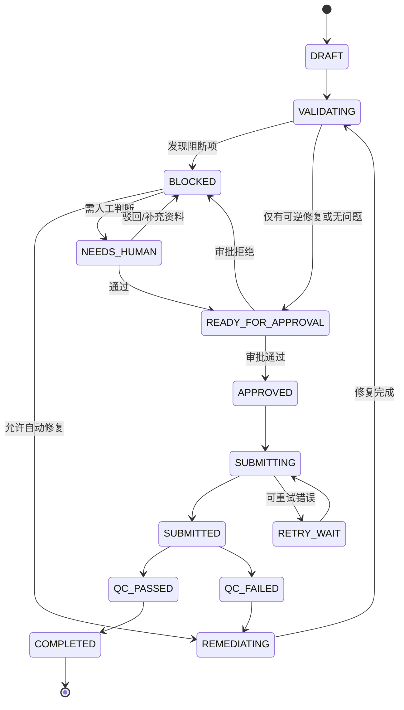

# 领域模型与状态机

## 领域对象

| 对象 | 说明 |
|---|---|
| Release | 某一集内容面向一个地区/平台的交付实例 |
| Asset | 视频、字幕、音频、图片或元数据文件 |
| RuleSet | 平台、语言、地区的确定性校验规则 |
| Finding | QC 或版权检查发现的问题 |
| Action | Agent 提议或执行的动作 |
| Approval | 对高风险动作的人工决定 |
| DeliveryAttempt | 一次平台提交及其回执 |
| AuditEvent | 不可变审计事件 |

## Release 状态

## 幂等规则

`idempotencyKey = releaseId + actionType + inputVersion + targetPlatform`。同一键只能产生一个有效动作结果；平台提交必须保存外部 request id。
