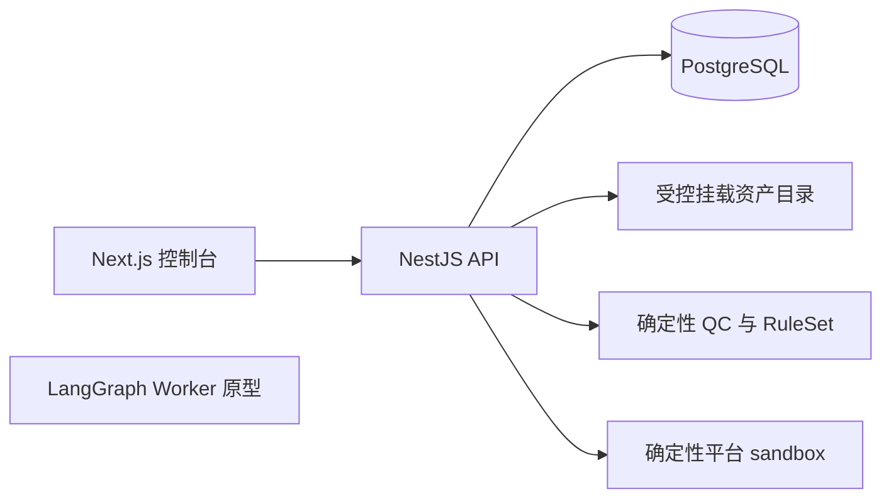

# 系统架构

## 当前实现

当前 API 同步执行 QC、动作和 sandbox 提交。Worker 图尚未接入领域事实源或任务队列；对象存储、Redis/BullMQ、模型、真实平台和 OpenTelemetry 均未实现。

## 目标架构

目标架构及 API/Worker 的唯一写入路径见[持久化交接](15-durable-execution-handoff.md)。在该设计完成前，下面的边界描述是目标，不是当前运行拓扑。

## 边界

- Next.js：项目、资产、发现项、审批、时间线和指标展示；不执行媒体检查。
- NestJS：认证、领域 API、任务入队、权限、审计查询；不把复杂流程塞进 Controller。
- Workflow Worker：目标为执行可恢复图；每个节点小而幂等。
- QC：纯函数/CLI 封装，输出结构化 Finding；不调用模型。
- Model Adapter：结构化输出、分类、解释和文案草拟；不直接拥有生产凭证。
- Platform Adapter：只接受已审批的 DeliveryCommand，返回标准化回执。

## 运行模式

当前 API 与 Worker 代码可分别构建，但长流程还未真正转移给 Worker。目标是分离部署，使用 PostgreSQL 持久化状态，Redis 仅作队列唤醒，不作为事实来源。

## 运行探针

- `GET /health` 是存活探针：只证明 HTTP 进程可以响应，不访问依赖。
- `GET /health/ready` 是就绪探针：调用当前 Repository 的 `healthCheck`。内存模式立即就绪；PostgreSQL 模式执行 `SELECT 1`。依赖不可用时返回 503，负载均衡器不应把流量导向该实例。
