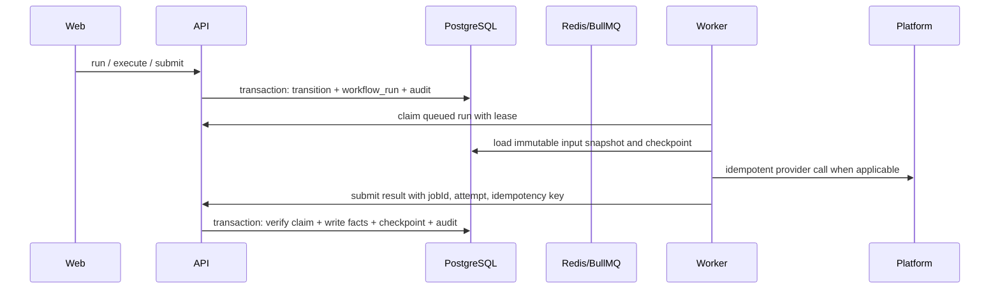

# API 与 Worker 的持久化交接

## 决策

领域事实只由 API 写入 PostgreSQL；Worker 只执行被领取的工作并提交带幂等键的结果。MVP 中一个 `workflow_runs` 行同时是一次业务运行和一个可领取的后台任务；Redis/BullMQ 只负责将来的唤醒和延迟投递，不能成为事实来源。

本决策取代“把现有 LangGraph 的内部 checkpoint 直接当成 Release 状态机”的做法。Graph 可以重放计算节点，但不能绕过 API 修改 Release、Action、Approval、Delivery、Asset 或 AuditEvent。

## 当前实现与目标

| 能力 | 当前实现 | 本交接完成后 |
|---|---|---|
| Release 事实源 | PostgreSQL / 内存仓储 | PostgreSQL / 内存仓储 |
| 运行记录 | `workflow_runs`，由 API 同步写入 | `workflow_runs`，由 Worker checkpoint 回写与租约保护 |
| 长任务 | API 进程内执行 | Worker 领取 `workflow_runs` 执行 |
| 队列可靠性 | 无 | PostgreSQL 持久化轮询；多 job 类型后再增加 outbox + Redis/BullMQ 唤醒 |
| 外部提交 | API 调用 sandbox adapter | Worker 调用 adapter，API 原子收尾 |

表中“本交接完成后”是待实现目标，不能作为当前能力对外宣称。

## 单一写入路径

MVP Worker 轮询 API 领取已持久化的 run，因此 API 或 Worker 重启不会丢失任务。Worker 不直接写业务表，避免 Graph 与 REST 路径产生两套状态机。未来出现多个独立 job、延迟重试或高吞吐需求时，再以 outbox + Redis/BullMQ 提供通知；重复通知仍由 run ID 去重。

## 运行与作业模型

`workflow_runs` 保留一个逻辑运行：`RUNNING`、`WAITING`、`COMPLETED` 或 `FAILED`。`checkpoint_json` 必须包含 `schemaVersion`、冻结的输入资产 ID/SHA-256、当前节点、最近成功节点、结果摘要与可公开的错误代码；不得保存原始文件内容、token 或 provider 密钥。

MVP 中每个 `workflow_runs` 行只执行一个 `EVALUATE_RELEASE` 操作：

| 字段 | 约束 |
|---|---|
| `id` | UUID；队列去重键 |
| `checkpoint_json.type` | 当前为 `EVALUATE_RELEASE`；未来可拆分 `EXECUTE_ACTION`、`SUBMIT_DELIVERY`、`POLL_DELIVERY` |
| `status` | `WAITING`、`RUNNING`、`COMPLETED`、`FAILED` |
| `checkpoint_json.attempt` / `maxAttempts` | 明确重试预算 |
| `lease_owner` / `lease_expires_at` | 防止 Worker 停机后永久占用 |
| `checkpoint_json` | 最小引用：Release ID、冻结版本、节点、结果摘要；不复制领域事实 |

Worker 的业务结果只能通过 API 内部命令提交。API 验证 `runId`、lease owner、attempt、输入版本和幂等键后，在一个数据库事务中更新领域事实、checkpoint、run 状态和审计事件。

## 失败、恢复与外部副作用

1. Worker 在外部调用前持久化 `SUBMITTING` checkpoint 与 idempotency key。
2. provider 超时后，Worker 先按该 key 查询回执；未知结果进入 `RETRY_WAIT`，不盲目重发。
3. 只有 provider 明确拒绝、超过重试预算或输入不再匹配时，才把 run 标为 `FAILED`；API 将 Release 落到可人工处理的状态并写审计。
4. lease 到期的 `RUNNING` run 可被重新领取。Worker 必须先读取 checkpoint；已完成节点不重新产生外部副作用。
5. Approval、资产 SHA-256、RuleSet 版本或 Release version 改变时，旧 run 的结果被 API 拒绝并记录为 stale，不覆盖新事实。

这提供的是可证明的 at-least-once 执行，不承诺无法实现的跨 provider exactly-once；外部 exactly-once 依赖 provider 的 idempotency key 或可查询回执。

## LangGraph 边界

LangGraph 只编排 Worker 内的纯计算、可重试工具调用和暂停/恢复节点。每个节点从已冻结的 checkpoint 读取，输出一个可验证的结果补丁；API 在接受补丁后更新领域状态。LangGraph 的内存 checkpointer 不能作为生产恢复依据，生产恢复只从 PostgreSQL checkpoint 开始。

当前 `apps/worker/src/release-evaluation.ts` 已作为 API 调用的纯计算图，输出不会直接修改领域事实；它是 `EVALUATE_RELEASE` run 的执行器基础。`apps/worker/src/workflow.ts` 仍是更完整的独立图原型，不得直接接管 API 的 Action/Approval/Delivery 状态。接入时先把它收敛成上述 run type 的执行器，并为每个节点保留回放测试。

## 交付顺序与验收

1. 为 `workflow_runs` 增加租约，并以事务创建 queued run/audit。
2. Worker 领取、续租、重试与失败处理；至少覆盖进程中断后的重新领取。
3. API 内部结果命令与 optimistic 输入版本校验；证明 stale worker 不能覆盖新版 Release。
4. 把 `EVALUATE_RELEASE` 接入 Worker 后，再迁移 `SUBMIT_DELIVERY`，保留 provider 回执恢复测试。
5. 多 job 类型或需要低延迟时，增加 outbox + Redis/BullMQ、指标和告警；PostgreSQL 扫描仍是恢复兜底。

验收需要真实 PostgreSQL：并发启动两个 Worker、杀掉持有 lease 的 Worker、等待 lease 过期、确认另一个 Worker 恢复同一个 job，且 provider 调用次数仍由 idempotency key 约束。
